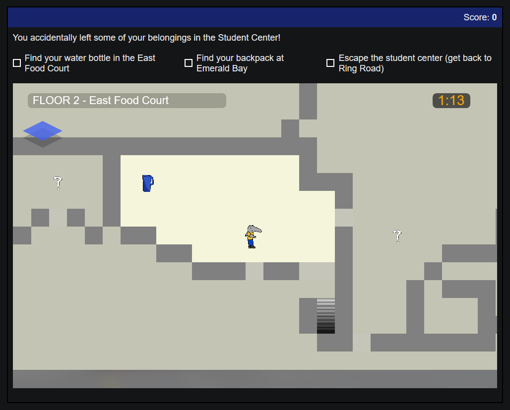
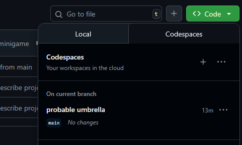

# PetrWare

Our project for the 2025 GitHub x UCI Summer Hackathon!

PetrWare is a series of minigames about UCI culture, playable in your browser.

**For info on running the game, scroll down to [Running the Game](#development-running-the-game)**



For contributors, this file documents how to run the game and develop new features.

If you want to play the game, scroll to the bottom for instructions!

## Development: Running the Game
You can run the game through GitHub Codespaces.
1. Click on the green Code button on GitHub, then navigate to Codespaces:
2. Launch the codespace `probable umbrella` (based on the `main` branch)


Use the terminal to run the game from the `petrware` folder:
```sh
cd petrware
npm run dev
```

The game will run on `localhost:5173`.
If you're in Codespaces, a message should appear in the bottom right
with a button for you to visit the instance in your browser.

## Development: Contributing
Since this is a simple browser game, it's frontend-only. It is made using:
- Vite
- React
- Typescript

Since it's a series of minigames, they are provided sequentially through our React architecture
and linked together by the main `App.tsx` page.

To add a game:
- Create a folder under `petrware/src` named after your game (e.g. `maze_minigame`)
- In this folder, put all code internal to your game, like the main display, constants, and gameplay logic
- Be sure to clean up everything once the game ends! (i.e. clean up event handlers in `useEffect` statements)
- You can add needed assets in `petrware/src/assets`
- Link the game to the other games in `App.tsx`
```
                App.tsx
  ___________________________________
  |                      Score: xyz |
  |_________________________________|       your_game/YourGame.tsx
  |                                 |        ____________________
  |  <CurrentGame onFinish={...} />   <---->    props: onFinish |
  |                                 |        |                  |
  |   (State that persists across   |        | (Internal state) |
  |     games, like total score)    |        |                  |
  |                                 |        |                  |
  |                                 |        |__________________|
  |                                 |
  |_________________________________|
```
To help us collaborate, make sure to:
- Create a separate branch/fork with your changes then request to merge it in when you're done
- Try testing your changes on the Codespace (see [Running the Game](#development-running-the-game) above)

## Playing the Game

### Maze Minigame


Controls: WASD or Arrow Keys to move around

Use stairs to navigate between floors


Explore the map to find all your belongings!

Water Bottle


Backpack


Now escape to Ring Road!

### UTC Game


Controls: Click to hold the card and drag to swipe the card. Do it at the right speed to make sure the card reads correctly!


### Ring Road Game

Controls: Use arrow keys to move around

Get to the other side of Ring Road and avoid all the bikes on the path!!


### Photo-taking Game

Controls: Click the animals to take pictures of them

Taking photos of squirrels will give you a point, but taking a photo of a crow will cause you to lose points! Take as many photos of squirrels as you can in 30 seconds!


